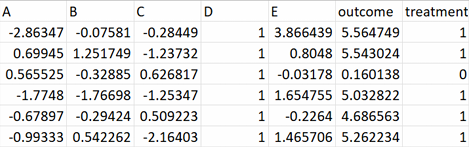

<h2>

🔗Can we identify causal relationships simply by looking at correlations?🔗

</h2>

This repository explores the difference between **association and causation** using simulated healthcare data.

## 🧠 What was the idea?

We started with a dataset containing **7 variables**:

🔵 A

🟢 B 

🟡 C

🟠 D

🔴 E

💊 Treatment

❤️ Outcome

The underlying causal relationships were not initially used to construct a DAG based on our observations.

Instead, we first asked:

**"If we only look at the correlations, what results should we expect?"**

## 📊 Exploring the correlations

We first examined the correlations between the variables.

  

Several variables showed relatively strong associations.

This allowed us to construct a **hypothesised causal structure** based purely on the observed correlations.

## 📊 Our hypothesised DAG

Based on the correlations, we created a DAG representing what we thought the causal structure might look like.

## 🤖 Applying causal discovery

We then applied the **PC algorithm** to the same dataset.

The algorithm attempts to identify the underlying causal structure by testing whether variables are conditionally independent of one another.

## ⚖️ Hypothesis vs Discovered Structure

We compared the DAG based on correlations with the structure identified by the PC algorithm.

* The MC graph is highly accurate and captures nearly the entire true causal architecture. However, the model fails to capture the B-outcome relationship.
* The MC graph successfully captures A and E as true confounders.

## 🚨 Correlation ≠ Causation

One of the main lessons from this experiment was that **A strong association between two variables does not necessarily represent a direct causal relationship.**